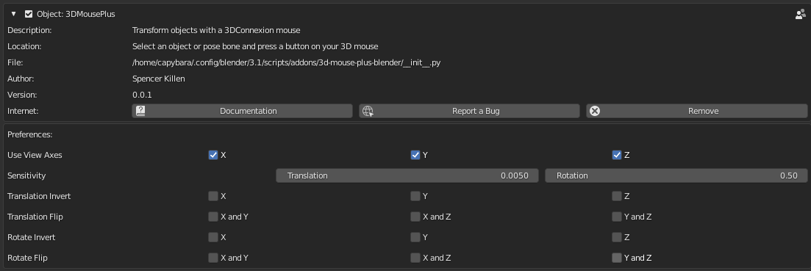

# 3DMousePlus Blender Addon

A Blender Addon for transforming objects with a 3DConnexion mouse.
Support for Windows and Linux.

# Purchase
- [Gumroad](https://sjkillen.gumroad.com/l/3d-mouse-plus-blender)
- [Free trial](https://github.com/sjkillen/3d-mouse-plus-blender/releases/download/Demo/3d-mouse-plus-blender.zip)

## Installation

## Windows
- No additional installation steps required

## Linux
- OSX is untested but may work
- Install [libspnav.so](https://github.com/FreeSpacenav/libspnav)
    - Ubuntu: `sudo apt install libspnav-dev`

## Use
- Tool is activated by selecting an object an pushing a button on the 3D mouse
- Transforms occur in global space transformed by the view matrix (Moving your viewport will affect how objects are transformed)
- The right button on the 3D mouse toggles between "rotation only" and "translation only" modes
- And the left button will renable both translation and rotation
- Pressing the space bar while using the tool will toggle "bend mode" (useful for armatures)
- Use ESC, Enter, and left/right mouse buttons to exit transform mode
- Tested only in object and pose mode.

## Configuration

- All options are in the addon preferences panel in the settings.
- Axes can be flipped or inverted and the sensitivity can be adjusted here
- Moving objects relative to viewport axes can be disabled for individual axes (or entirely if all axes are unchecked)

## Known Issues
- Report issues [here](https://github.com/sjkillen/3d-mouse-plus-blender/issues)
